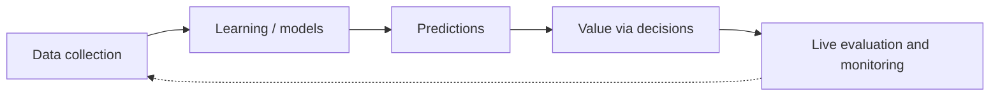
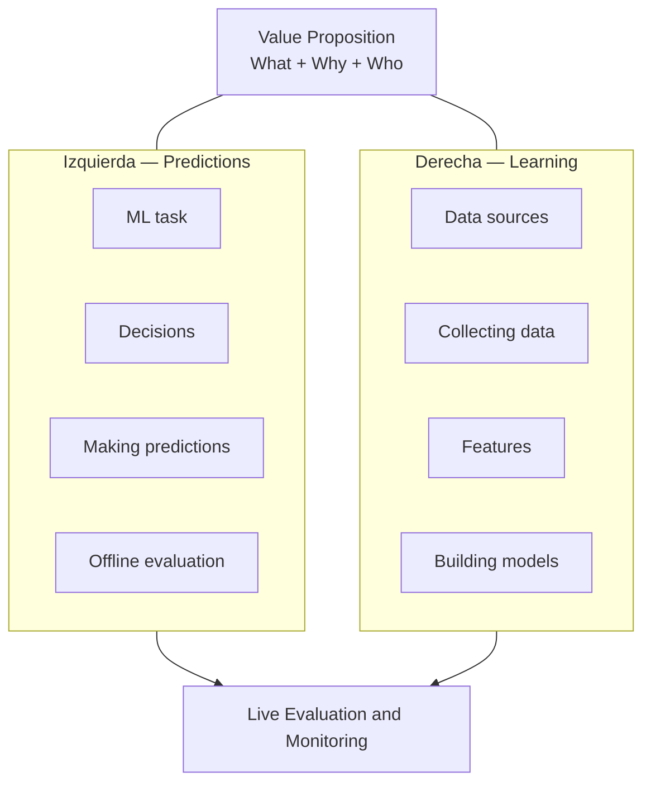
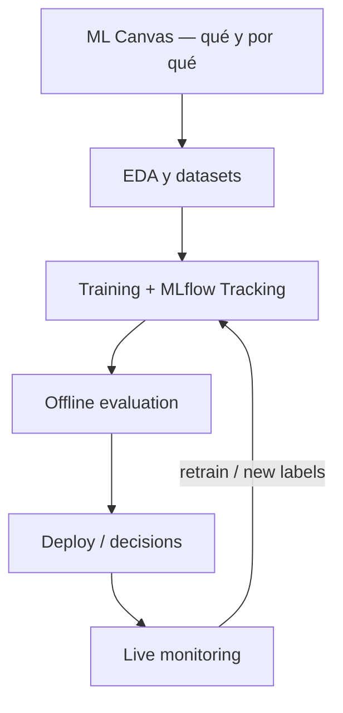

# Machine Learning Canvas (Dorard) — Part I

> [!summary] Idea en una frase
> El **Machine Learning Canvas** es un lienzo visual para alinear *value proposition*, predicciones, aprendizaje a partir de datos y evaluación en vivo, de modo que el equipo no construya modelos precisos para el problema equivocado.

> [!info] Alcance de Part I
> Este artículo introduce el **porqué** del canvas, la **estructura de bloques** y el uso colaborativo. Dorard anuncia Part II para el detalle de qué escribir en cada bloque. Aquí profundizamos Part I y añadimos ejemplos / conexiones de estudio (Iris/churn, MLflow, TC5061) sin inventar contenido de Part II.

---

## Por qué existe este canvas

Los sistemas de ML son complejos: ingieren datos en un formato, aprenden un modelo que **predice**, y esas predicciones solo crean valor cuando **informan o automatizan decisiones**.

Ejemplo del artículo: **churn** (clientes frágiles que podrían irse en N días). Predecir churn no vale nada solo; vale cuando decides *qué oferta promocional dar a quién* para retener.

### El desalineamiento típico

| Quién | Sabe… | Riesgo |
|---|---|---|
| Data scientists / ML engineers | Construir modelos *accurate* | Resolver el problema equivocado; modelos que nadie usa |
| Product / business | Objetivos de la organización | No traducir el objetivo a una *ML task* usable |
| Engineering | Sistemas, latencia, datos | Integrar un modelo sin *feedback loop* ni métricas de valor |

Dorard: cuando sí trabajan el problema correcto, **alinear actividades** entre backgrounds distintos sigue siendo difícil. Un **canvas** facilita esa colaboración.

Q:: ¿Cuándo una predicción se vuelve valiosa según Dorard?
A:: Cuando se usa para informar o automatizar decisiones que entregan el value proposition al usuario / negocio.

---

## Qué es un canvas (contexto)

Herencia startup:

- [[Business Model Canvas]] → [[Lean Canvas]] (muy popular)
- También hay canvases de otros dominios (Culture Creation, Mobile stickiness, etc.)

Un canvas **no** es un essay: es un chart visual donde cada componente clave tiene su bloque, y la **proximidad espacial** comunica relaciones.

Para data / AI, el canvas describe el *learning* del sistema inteligente:

1. **De qué datos** aprendemos  
2. **Cómo usamos** las predicciones impulsadas por ese aprendizaje  
3. **Cómo aseguramos** que el sistema “funciona” a lo largo del tiempo  

---

## Estructura del Machine Learning Canvas

### Centro: Value Proposition

Bloque central = **What + Why + Who**

| Pregunta | Significado |
|---|---|
| **What** | Qué estamos tratando de lograr |
| **Why** | Por qué importa |
| **Who** | Quién usa el sistema / quién es impactado |

A partir de ahí, el **How** se parte en dos mitades:

- **Izquierda → Predictions** (usar el modelo)
- **Derecha → Learning** (crear/actualizar el modelo)

> [!tip] Lectura espacial (según Dorard)
> - **Arriba** = vista de fondo / dominio  
> - **Abajo** = especificidad del sistema / motor predictivo  
> - **Upper left & right** = integración con el dominio (decisiones + recolección de datos)  
> - **Lower left & right** = “predictive engine” y constraints (latencia / throughput al predecir y al reentrenar)

---

## Bloques — lado Predictions (izquierda)

| Bloque | Pregunta guía (Part I) |
|---|---|
| **ML task** | Tipo (classification, regression, …), **input**, **output** a predecir (y valores posibles) |
| **Decisions** | Cómo las predicciones se usan para tomar decisiones que entregan el value propuesto |
| **Making predictions** | **Cuándo** predecimos sobre inputs nuevos y **cuánto tiempo** tenemos (latency / batch vs online) |
| **Offline evaluation** | Métodos y métricas para evaluar predicciones **antes** del deployment |

Q:: Nombra los cuatro bloques del lado Predictions.
A:: ML task, Decisions, Making predictions, Offline evaluation.

---

## Bloques — lado Learning (derecha)

| Bloque | Pregunta guía (Part I) |
|---|---|
| **Data sources** | ¿Qué fuentes de datos crudos podemos usar? |
| **Collecting data** | ¿Cómo obtenemos datos nuevos para aprender (**inputs AND outputs**)? |
| **Features** | Representaciones de input a extraer de las fuentes crudas |
| **Building models** | **Cuándo** creamos/actualizamos modelos con datos nuevos y **cuánto tiempo** tenemos para eso |

> [!important] Inputs AND outputs
> Collecting data no es solo “juntar features”. Necesitas el **label / target** (output) para supervised learning. Sin plan de labels, no hay learning loop.

Q:: Nombra los cuatro bloques del lado Learning.
A:: Data sources, Collecting data, Features, Building models.

---

## Bloque inferior: Live Evaluation and Monitoring

Aquí defines métodos y métricas para evaluar el sistema **después del deployment** y **cuantificar value creation** en el dominio (no solo accuracy offline).

| Fase | Dónde vive en el canvas | Pregunta |
|---|---|---|
| Antes de desplegar | Offline evaluation (izq.) | ¿El modelo predice “bien” en holdout / simulación de decisión? |
| Después de desplegar | Live Evaluation and Monitoring | ¿El sistema crea valor en producción? ¿Se degrada? |

> [!abstract] Puente a MLflow / MLOps
> - **Offline evaluation** ↔ metrics que logueas en un [[MLflow Tracking Quickstart — estudio a profundidad|Run]] antes de promover  
> - **Live Evaluation and Monitoring** ↔ dashboards, drift, business KPIs, alertas post-deploy  
> El canvas dice *qué* medir y *por qué*; MLflow Tracking es una forma de *registrar* la evidencia experimental offline.

---

## Ejemplo trabajado: churn (del artículo)

Rellena mentalmente el canvas con el ejemplo de churn que Dorard usa:

| Bloque | Ejemplo churn (ilustrativo) |
|---|---|
| Value Proposition | Reducir pérdida de clientes / retener revenue; usado por CRM / customer success |
| ML task | Classification: cliente → P(churn en N días) o clase churn/no-churn |
| Decisions | Qué oferta promocional dar a quién (o si contactar) |
| Making predictions | Batch diario vs score en tiempo real al abrir ticket |
| Offline evaluation | Precision/recall @k, uplift vs baseline de retención, cost-sensitive metrics |
| Data sources | CRM, billing, product usage logs, support tickets |
| Collecting data | Histórico de churn etiquetado; plan para labels futuros |
| Features | Tenure, usage frequency, tickets, spend, … |
| Building models | Reentrenar semanal / al drift; presupuesto de cómputo |
| Live eval | Churn rate, retention lift, costo de ofertas, false-positive fatigue |

> [!warning] No confundas métrica de modelo con valor
> Accuracy alta offline ≠ value. Si las Decisions no cambian (nadie actúa sobre el score), el canvas está roto en el centro/izquierda aunque el modelo sea “bueno”.

---

## Cómo usarlo en el trabajo (según Dorard)

1. **Bajar la visión** del sistema ML a un lienzo compartido  
2. **Comunicar** con el equipo multidisciplinario  
3. Conectar lo que ML *puede* hacer con **objetivos de la organización**  
4. Empezar a **assess feasibility**  
5. Al llenarlo, **identificar constraints** que condicionan la tecnología a elegir  
6. Idealmente **antes de Exploratory Data Analysis (EDA)**

Cita del artículo (Ingolf Mollat, Blue Yonder): el canvas da a clientes el *first critical entry point* para implementar predictive applications.

Q:: ¿En qué momento del proyecto recomienda Dorard llenar el ML Canvas respecto a la EDA?
A:: Típicamente **antes** de la Exploratory Data Analysis, para fijar constraints y alineación.

---

## Mini checklist al llenar el canvas

- [ ] Value Proposition escribe What / Why / Who sin jerga de modelo  
- [ ] ML task tiene tipo + input + output explícitos  
- [ ] Decisions explica *acción* que sigue a la predicción  
- [ ] Making predictions declara latencia / frecuencia  
- [ ] Offline evaluation elige métricas alineadas a Decisions (no solo accuracy por default)  
- [ ] Data sources son alcanzables legalmente / técnicamente  
- [ ] Collecting data incluye **cómo se obtienen labels**  
- [ ] Features son derivables de esas sources  
- [ ] Building models declara cadencia de retrain y presupuesto de tiempo  
- [ ] Live Evaluation mide **value** en dominio, no solo loss  

---

## Relación con otros artefactos del curso

| Artefacto | Rol |
|---|---|
| ML Canvas (este) | Diseño del *sistema* ML orientado a valor |
| [[Sculley Hidden Technical Debt]] | Por qué el glue (data, config, monitoring) se pudre sin disciplina |
| [[MLflow Tracking Quickstart — estudio a profundidad]] | Instrumentación de experiments / runs offline |
| Plantilla descargable (Canvas TC5061) | The Machine Learning Canvas — plantilla para llenar |

---

## Limitaciones conscientes de Part I

- No detalla “qué escribir exactamente” en cada bloque (eso es Part II).  
- No prescribe un algoritmo, stack ni metric set universal.  
- El valor del canvas es de **alineación**; no reemplaza validación estadística ni MLOps operativo.

---

## Flashcards

Q:: ¿De qué se deriva conceptualmente la popularidad de los canvases que menciona Dorard?
A:: Del Lean Canvas, a su vez derivado del Business Model Canvas, usados para describir objetos complejos de forma colaborativa.

Q:: ¿Cómo se parte el How en el ML Canvas?
A:: En dos mitades: Predictions (izquierda) y Learning (derecha), alrededor del Value Proposition central.

Q:: ¿Qué captura Live Evaluation and Monitoring que Offline evaluation no captura?
A:: El desempeño y la creación de valor **después del deployment**, en el dominio real.

Q:: ¿Qué constraints de “predictive engine” sitúa Dorard en la parte baja del canvas?
A:: Latency y throughput para **hacer predicciones** y para **actualizar modelos**.

Q:: Según el artículo, ¿qué perfiles suelen desalinearse en proyectos de ML?
A:: Data science, engineering, product y business (backgrounds distintos colaborando en algo innovador).

---

## Práctica sugerida (15–30 min)

1. Descarga la plantilla del Machine Learning Canvas (link del curso / sitio del autor).  
2. Llena un canvas para **un** use case pequeño (churn toy, Iris-as-product, o tu idea de LLM Eval Gate: ¿qué se predice/decide?).  
3. Marca en rojo el bloque más vacío: ahí está tu mayor riesgo de proyecto.  
4. Cruza Offline evaluation con lo que loguearías en MLflow en el primer experiment.

---

## Referencias

- Dorard, L. (2016). [From Data to AI with the Machine Learning Canvas (Part I)](https://medium.com/louis-dorard/from-data-to-ai-with-the-machine-learning-canvas-part-i-d171b867b047)  
- Canvas TC5061: *The Machine Learning Canvas — plantilla descargable*  
- Relacionados: [[MLflow Tracking Quickstart — estudio a profundidad]], [[Sculley Hidden Technical Debt]], [[Lean Canvas]]

---

## Metadatos de estudio

- Fuente leída completa (Medium Part I, ~5 min read)  
- Profundización pedagógica: ejemplo churn expandido + puente MLflow/MLOps (no está en el artículo como stack concreto; es conexión de estudio)  
- Licencia: el autor indica Creative Commons en el cierre del post  
