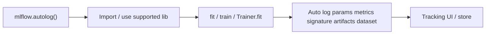
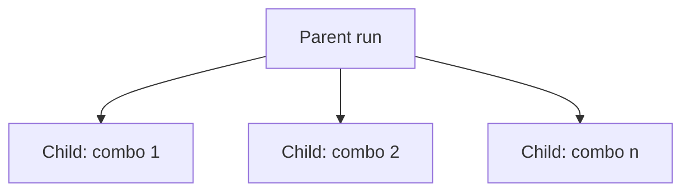

# Automatic Logging with MLflow Tracking

> [!summary] Idea en una frase
> **`mlflow.autolog()`** hace que MLflow registre metrics, parameters, model signature, artifacts (p. ej. checkpoints) y datasets *sin* llamadas explícitas a `log_metric` / `log_param` / `log_model`: el logging se dispara al entrenar (`fit` / `train` / `Trainer.fit`, según el flavor).

> [!info] Relación con el video quickstart
> En [[MLflow Tracking Quickstart — estudio a profundidad]] el demo usa logging **manual**. Autolog es el camino corto para el mismo Tracking store/UI. Ambos conviven: puedes autolog + `log_*` extra en el mismo run.

---

## 1. Qué hace autolog (contrato)

Llamas **antes** del training:

```python
import mlflow

mlflow.autolog()

with mlflow.start_run():
    # your training code goes here
    ...
```

MLflow preselecciona qué loguear según **modelo + library**:

| Categoría | Qué entra (docs) |
|---|---|
| **Metrics** | Set preseleccionado según library/modelo |
| **Parameters** | Hyperparams del training + **defaults** de la library si no los fijaste |
| **Model Signature** | Schema de input/output del modelo |
| **Artifacts** | p. ej. model checkpoints |
| **Dataset** | Objeto de dataset de training si aplica (ej. `tensorflow.data.Dataset`) |



Q:: ¿Qué tienes que llamar para habilitar automatic logging genérico?
A:: `mlflow.autolog()` antes del código de training.

---

## 2. Quickstart oficial (4 pasos)

### Step 1 — Instalar

```bash
pip install mlflow
```

### Step 2 — Insertar `mlflow.autolog` (ejemplo sklearn)

```python
import mlflow
from sklearn.model_selection import train_test_split
from sklearn.datasets import load_diabetes
from sklearn.ensemble import RandomForestRegressor

mlflow.autolog()

db = load_diabetes()
X_train, X_test, y_train, y_test = train_test_split(db.data, db.target)

rf = RandomForestRegressor(n_estimators=100, max_depth=6, max_features=3)

# MLflow triggers logging automatically upon model fitting
rf.fit(X_train, y_train)
```

> [!tip] Disparador en sklearn
> El logging se dispara en **`fit`**, no al construir el estimador.

Observa: en este snippet oficial **no** hay `with mlflow.start_run():`. Eso conecta con la regla de runs activos (abajo, TensorFlow/PyTorch): si no hay run, autolog puede **crear y cerrar** uno solo.

### Step 3 — Ejecutar

```bash
python YOUR_ML_CODE.py
```

### Step 4 — UI

```bash
mlflow server --port 8080
```

Abrir `http://localhost:8080`.

> [!note] Puerto
> El video quickstart usaba **5000**; esta página de autolog usa **8080**. Ambos son válidos: lo importante es que `tracking_uri` / el server coincidan con lo que abres en el browser.

Q:: En el ejemplo sklearn de la docs, ¿cuándo se dispara el autolog?
A:: Al llamar `rf.fit(...)`.

---

## 3. Personalizar comportamiento

```python
import mlflow

mlflow.autolog(
    log_model_signatures=False,
    extra_tags={"YOUR_TAG": "VALUE"},
)
```

La docs remite a la firma completa de `mlflow.autolog()` para el set de argumentos (no los enumera todos en esta página).

Casos de uso típicos de personalización:

- Apagar signatures / artifacts pesados en sweeps grandes  
- Inyectar tags de proyecto / ticket / data version  

---

## 4. Enable / disable por library (flavors)

Caso común: entrenas en **PyTorch** pero usas **sklearn** solo para preprocessing → no quieres runs basura de sklearn.

**Opción 1 — solo PyTorch**

```python
import mlflow

mlflow.pytorch.autolog()
```

**Opción 2 — apagar sklearn, dejar el resto**

```python
import mlflow

mlflow.sklearn.autolog(disable=True)
mlflow.autolog()
```

> [!important] Cómo funciona el genérico
> `mlflow.autolog()` habilita autologging para **cada library soportada que tengas instalada**, en cuanto la importas. Alternativa: llamadas por flavor (`mlflow.pytorch.autolog()`, `mlflow.sklearn.autolog()`, …) para control explícito.

Para flavors que guardan el modelo como artifact, también se loguean archivos de **dependency management** (env / requirements).

Q:: ¿Cómo desactivas autolog solo para scikit-learn?
A:: `mlflow.sklearn.autolog(disable=True)` (y luego, si quieres, `mlflow.autolog()` para el resto).

---

## 5. Libraries populares con autolog (lista de esta página)

| Library | API típica |
|---|---|
| Keras / TensorFlow | `mlflow.autolog()` o `mlflow.tensorflow.autolog()` |
| LightGBM | `mlflow.lightgbm.autolog()` |
| Paddle | `mlflow.paddle.autolog()` |
| PySpark ML | `mlflow.pyspark.ml.autolog()` |
| PyTorch | `mlflow.pytorch.autolog()` (**solo PyTorch Lightning**) |
| Scikit-learn | `mlflow.sklearn.autolog()` |
| Spark (datasources) | `mlflow.spark.autolog()` |
| Statsmodels | `mlflow.statsmodels.autolog()` |
| XGBoost | `mlflow.xgboost.autolog()` |

Hay más integraciones; la lista crece. Consulta páginas dedicadas por library.

---

## 6. Qué captura cada flavor (mapa de estudio)

### 6.1 Keras / TensorFlow (`tensorflow>=2.3`)

También loguea métricas de `tf.estimator` y `EarlyStopping`.

| Framework | Metrics | Parameters | Artifacts |
|---|---|---|---|
| `tf.keras` | Training/validation loss; user metrics | `fit()` params; optimizer name; LR; epsilon | Model summary al start; MLflow Model (Keras); TensorBoard logs al end |
| `EarlyStopping` | p. ej. `stopped_epoch`, `restored_epoch`, … | p. ej. `min_delta`, `patience`, `baseline`, `restore_best_weights` | — |

**Gestión de runs (regla clave):**

| Situación al capturar | Comportamiento |
|---|---|
| **No** hay active run | MLflow **crea** un run y lo **termina** al acabar `tf.keras.fit()` |
| **Sí** hay active run | Loguea ahí y **no** lo cierra al terminar el training; tú debes `end_run` / salir del context |

### 6.2 LightGBM / XGBoost

| | LightGBM | XGBoost |
|---|---|---|
| Metrics | user-specified | user-specified |
| Parameters | `lightgbm.train` | `xgboost.train` |
| Artifacts | Model + signature; feature importance; input example | Model + signature; feature importance; input example |
| Early stopping | Metrics en best iteration como step extra | Igual |

### 6.3 Paddle

- Metrics: user-specified  
- Params: `paddle.Model.fit`  
- Artifact: MLflow Model + signature al end  

### 6.4 PySpark ML

| Metrics | Parameters | Tags | Artifacts |
|---|---|---|---|
| Post-training vía `Evaluator.evaluate` | De `Estimator.fit` | Class name + FQCN | Fitted estimator + `metric_info.json` |

### 6.5 PyTorch (Lightning only)

Trigger: `pytorch_lightning.trainer.Trainer.fit`.

Misma regla de **auto-create/end run** vs run ya activo que en Keras.

Limitaciones documentadas:

- Params **no** pasados explícitamente (defaults) en `Trainer.fit()` **no** se autologuean hoy  
- Multi-optimizer (p. ej. autoencoder): solo params del **primer** optimizer  
- EarlyStopping: métricas/params del callback + best checkpoint si para por early stop  

### 6.6 Scikit-learn (el más relevante para tu A01 / quickstart)

**Estimators y meta-estimators (p. ej. `Pipeline`)** → **un** run:

| Metrics | Parameters | Tags | Artifacts |
|---|---|---|---|
| Training score de `estimator.score` | `estimator.get_params` | Class name + FQCN | Fitted estimator |

**Parameter search (p. ej. `GridSearchCV`)** → **parent + nested children**:



| Run | Metrics | Parameters | Artifacts |
|---|---|---|---|
| **Parent** | Training score | Params del search estimator + **best** combo | Fitted search estimator; **best** estimator; search results **CSV** |
| **Child** | CV test score de esa combo | Esa combinación de params | — |

Q:: ¿Qué estructura de runs crea autolog con `GridSearchCV`?
A:: Un parent run con nested child runs (uno por combinación de params evaluada).

### 6.7 Spark (datasources, no MLlib models)

- Requiere SparkSession con JAR `org.mlflow.mlflow-spark`  
- Autolog de **Spark ML (MLlib) models: aún no soportado** en esta docs  
- Captura: tag con path / version / format (una línea por datasource)  
- Logging **asíncrono** → posibles race conditions en runs muy cortos  
- PySpark ≥ 3.2.0: `PYSPARK_PIN_THREAD=false`  

### 6.8 Statsmodels

- Params de `Model.fit`; cada subclass que overridea `fit` loguea los suyos  
- Artifact: ResultsWrapper al end  

---

## 7. Manual logging vs autolog (decisión de ingeniería)

| Criterio | Manual (`log_*`) | Autolog |
|---|---|---|
| Control fino de nombres/métricas | Alto | Limitado al set del flavor |
| Velocidad de prototipo | Más verbose | Muy alto |
| Preprocessing sklearn + DL | Natural | Hay que `disable` selectivo |
| Hyperparam search | Tú anidas runs | sklearn autolog anida solo |
| Curriculum TC5061 | Entender Tracking a fondo | Productividad + menos errores de olvido |
| Reproducibilidad de env | Tú logueas lo crítico | Flavors que save model también loguean deps |

> [!abstract] Recomendación de estudio
> 1) Domina manual (como el video). 2) Usa autolog en labs sklearn/XGBoost. 3) En pipelines mixtos, controla por flavor. 4) Siempre revisa en la UI qué se logueó de verdad (defaults incluidos).

---

## 8. Antipatterns / pitfalls

> [!warning] Runs “fantasma” de preprocessing
> `mlflow.autolog()` + `StandardScaler().fit` (sklearn) puede crear runs que no querías. Usa `mlflow.sklearn.autolog(disable=True)` o autolog solo del flavor de entrenamiento.

> [!warning] Run ya abierto
> Si entras con `start_run()` y usas Keras/Lightning autolog, el run **no** se cierra al terminar `fit`. Olvidar `end_run` contamina el siguiente training en el mismo proceso.

> [!warning] Defaults silenciosos
> Autolog registra hyperparams **default** de la library. Eso es bueno para reproducibilidad, pero ensucia la UI: aprende a filtrar / taggear.

> [!tip] Puente a ML Canvas
> Offline evaluation del [[Machine Learning Canvas (Dorard) — Part I]] = las metrics que autolog (o tú) dejas en el Run **antes** de deploy. Autolog no sustituye Live Evaluation.

---

## 9. Mini lab (15–20 min)

1. Copia el snippet `RandomForestRegressor` + `load_diabetes`.  
2. Corre con `mlflow.autolog()` sin `start_run`.  
3. Abre UI (`mlflow server --port 8080`) y lista: params (incl. defaults), metric de score, artifact del modelo.  
4. Repite **dentro** de `with mlflow.start_run():` y compara Duration / si el run queda abierto.  
5. (Opcional) `GridSearchCV` pequeño y observa parent/children.

---

## Flashcards

Q:: ¿Qué cinco tipos de información lista la docs como autologueables en general?
A:: Metrics, Parameters, Model Signature, Artifacts, Dataset (si aplica).

Q:: ¿PyTorch autolog soporta training “vanilla” sin Lightning?
A:: No según esta página: solo modelos entrenados con **PyTorch Lightning**.

Q:: ¿Spark autolog guarda modelos MLlib?
A:: No aún; autologuea información de **datasources** en read-time.

Q:: ¿Qué puerto usa el ejemplo de UI en la página de autolog?
A:: `8080` (`mlflow server --port 8080` → `http://localhost:8080`).

Q:: ¿Qué artifacts extras aparecen en el parent run de un parameter search sklearn?
A:: Fitted search estimator, fitted best estimator, y un CSV de search results.

---

## Referencias

- Docs: [Automatic Logging with MLflow Tracking](https://mlflow.org/docs/latest/ml/tracking/autolog/)  
- API: `mlflow.autolog()` (firma completa en API reference)  
- Curso: Canvas TC5061 — *Automatic Logging with MLflow Tracking*  
- Relacionados: [[MLflow Tracking Quickstart — estudio a profundidad]], [[Machine Learning Canvas (Dorard) — Part I]]

---

## Metadatos de estudio

- Fuente: docs oficiales MLflow (página Autologging, leída completa)  
- Conexiones pedagógicas (manual vs autolog, puertos 5000 vs 8080, Canvas) son de estudio; no alteran el contenido normativo de la docs  
