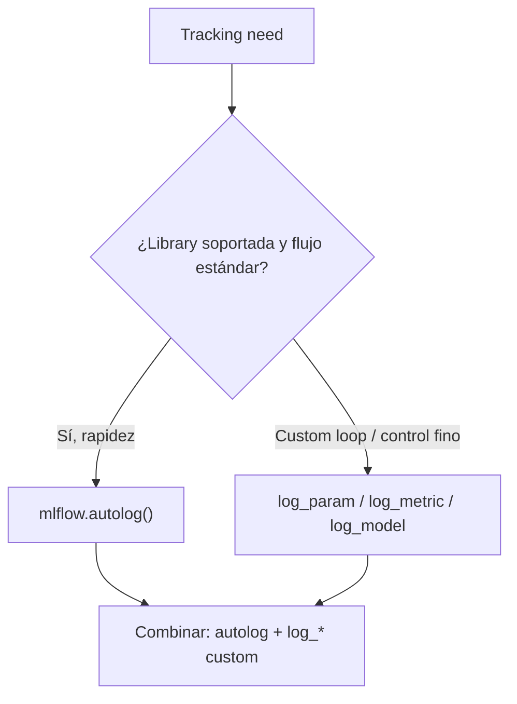
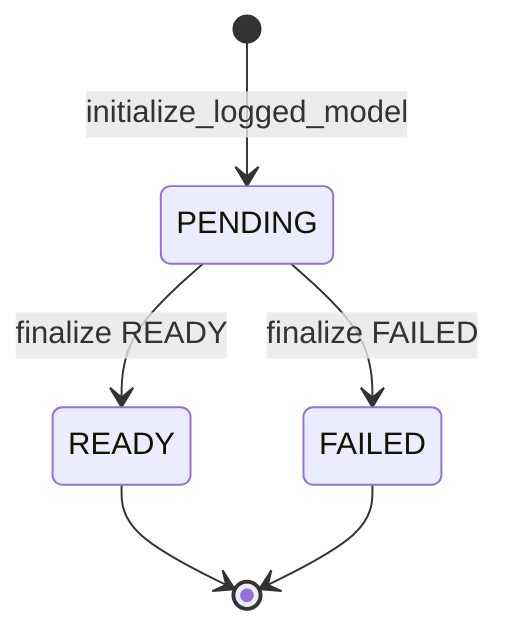
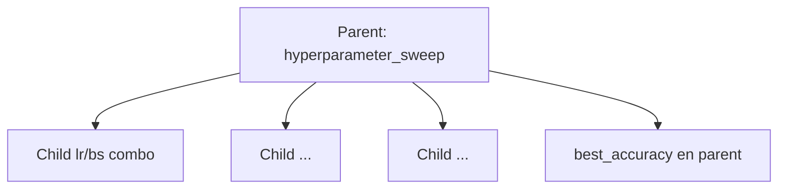

# MLflow Tracking APIs

> [!summary] Idea en una frase
> Las **Tracking APIs** son el contrato programático para capturar experiments: eliges **autolog** (cobertura máxima, setup mínimo) o **manual logging** (control total), y organizas runs con experiments, tags, métricas con `step`, nested runs y (en MLflow 3) **logged models** independientes del run.

> [!info] Mapa de las tres notas MLflow
> | Nota | Enfoque |
> |---|---|
> | [[MLflow Tracking Quickstart — estudio a profundidad]] | Demo UI + flujo manual concreto |
> | [[Automatic Logging with MLflow Tracking — estudio a profundidad]] | `mlflow.autolog()` y flavors |
> | **Esta** | Catálogo de APIs + patterns avanzados (nesting, parallel, tags, MLflow 3 models) |

---

## 1. Dos approaches (elige con intención)



### Automatic Logging

```python
import mlflow

mlflow.autolog()  # That's it!
model.fit(X_train, y_train)
```

Qué captura (resumen de esta página): params/hyperparams, train/val metrics, artifacts/checkpoints, plots, metadata del framework. Libraries: sklearn, XGBoost, LightGBM, PyTorch, Keras/TF, Spark, etc.

→ Detalle: [[Automatic Logging with MLflow Tracking — estudio a profundidad]]

### Manual Logging

Ideal para custom training loops y cuando necesitas decidir *exactamente* qué trackear.

```python
import mlflow

with mlflow.start_run():
    mlflow.log_param("learning_rate", 0.01)
    mlflow.log_param("batch_size", 32)

    for epoch in range(num_epochs):
        train_loss = train_model()
        val_loss = validate_model()
        mlflow.log_metrics(
            {"train_loss": train_loss, "val_loss": val_loss},
            step=epoch,
        )

    mlflow.sklearn.log_model(model, name="model")
```

También hay APIs en **Java** y **R** (core logging). Autolog completo es principalmente **Python**.

Q:: ¿Cuándo preferir manual logging sobre autolog?
A:: Custom training loops, control preciso de qué se trackea, o workflows que autolog no cubre bien.

---

## 2. Core API — tablas de estudio

### Setup & Configuration

| Function | Purpose | Example |
|---|---|---|
| `mlflow.set_tracking_uri()` | Conectar a server/DB | `mlflow.set_tracking_uri("http://localhost:5000")` |
| `mlflow.get_tracking_uri()` | URI actual | `uri = mlflow.get_tracking_uri()` |
| `mlflow.create_experiment()` | Crear experiment | `exp_id = mlflow.create_experiment("my-experiment")` |
| `mlflow.set_experiment()` | Experiment activo | `mlflow.set_experiment("fraud-detection")` |

### Run Management

| Function | Purpose | Example |
|---|---|---|
| `mlflow.start_run()` | Nuevo run (mejor con `with`) | `with mlflow.start_run(): ...` |
| `mlflow.end_run()` | Cerrar run | `mlflow.end_run(status="FINISHED")` |
| `mlflow.active_run()` | Run activo ahora | `run = mlflow.active_run()` |
| `mlflow.last_active_run()` | Último run completado | `last_run = mlflow.last_active_run()` |

### Data Logging

| Function | Purpose | Example |
|---|---|---|
| `log_param` / `log_params` | Hyperparameters | `mlflow.log_param("lr", 0.01)` |
| `log_metric` / `log_metrics` | Métricas | `mlflow.log_metric("accuracy", 0.95, step=10)` |
| `log_input` | Dataset info | `mlflow.log_input(dataset)` |
| `set_tag` / `set_tags` | Metadata | `mlflow.set_tag("model_type", "CNN")` |

### Artifact Management

| Function | Purpose | Example |
|---|---|---|
| `log_artifact` | Un file/dir | `mlflow.log_artifact("model.pkl")` |
| `log_artifacts` | Directorio completo | `mlflow.log_artifacts("./plots/")` |
| `get_artifact_uri` | Dónde viven los artifacts | `uri = mlflow.get_artifact_uri()` |

Q:: ¿Qué hace `mlflow.log_input()`?
A:: Registra información del dataset asociado al run.

---

## 3. Model Management — nuevo en MLflow 3

Los **logged models** se pueden trackear **independientes del run** (útil para agents, modelos externos, lifecycle custom).

| Function | Purpose |
|---|---|
| `initialize_logged_model()` | Modelo en estado **PENDING** |
| `create_external_model()` | Modelo externo (artifacts fuera de MLflow) |
| `finalize_logged_model()` | Status **READY** o **FAILED** |
| `get_logged_model()` | Por ID |
| `last_logged_model()` | Más reciente de la sesión |
| `search_logged_models()` | Búsqueda / filtros |
| `log_model_params()` | Params ligados a un `model_id` |
| `set_logged_model_tags()` / `delete_logged_model_tag()` | Tags del modelo |

### Active Model (trace linking)

| Function | Purpose |
|---|---|
| `set_active_model()` | Modelo activo para linkear traces |
| `get_active_model_id()` | ID activo |
| `clear_active_model()` | Limpiar |



Ejemplo externo (agent):

```python
model = mlflow.create_external_model(
    name="chatbot_agent",
    model_type="agent",
    tags={"version": "v1.0", "environment": "production"},
)
mlflow.log_model_params({"temperature": "0.7", "max_tokens": "1000"}, model_id=model.model_id)
mlflow.set_active_model(model_id=model.model_id)

@mlflow.trace
def chat_with_agent(message):
    return agent.chat(message)

traces = mlflow.search_traces(model_id=model.model_id)
```

Lifecycle custom:

```python
from mlflow.entities import LoggedModelStatus

model = mlflow.initialize_logged_model(name="custom_neural_network", model_type="neural_network", ...)
try:
    train_model(); validate_model()
    mlflow.pytorch.log_model(pytorch_model=model_instance, name="model", model_id=model.model_id)
    mlflow.finalize_logged_model(model.model_id, LoggedModelStatus.READY)
except Exception:
    mlflow.finalize_logged_model(model.model_id, LoggedModelStatus.FAILED)
    raise
```

> [!note] Cobertura por lenguaje
> Logged Model Management full está en **Python (MLflow 3)**. Java/R: no. REST: basic. Autolog rico: Python (15+ libs).

Q:: ¿Para qué sirve `create_external_model`?
A:: Trackear un modelo cuyos artifacts viven fuera de MLflow (p. ej. agent desplegado), con params/tags/traces linkeados.

---

## 4. Precise Metric Tracking

```python
import time

for epoch in range(100):
    loss = train_epoch()
    mlflow.log_metric("train_loss", loss, step=epoch)

now = int(time.time() * 1000)  # milliseconds
mlflow.log_metric("inference_latency", latency, timestamp=now)
mlflow.log_metric("gpu_utilization", gpu_usage, step=epoch, timestamp=now)
```

**Requisitos de `step`:**

- Entero 64-bit válido  
- Puede ser **negativo** o **out of order**  
- Permite **gaps** (ej. 1, 5, 75, -20)  

Q:: ¿En qué unidad espera MLflow el `timestamp` de `log_metric`?
A:: Milisegundos (epoch ms).

---

## 5. Experiment organization

Tres formas de fijar experiment:

```python
# 1) Env var
os.environ["MLFLOW_EXPERIMENT_NAME"] = "fraud-detection-v2"

# 2) set_experiment
mlflow.set_experiment("hyperparameter-tuning")

# 3) create con config
experiment_id = mlflow.create_experiment(
    "production-models",
    artifact_location="s3://my-bucket/experiments/",
    tags={"team": "data-science", "environment": "prod"},
)
```

---

## 6. Hierarchical / nested runs

Patrón para hyperparameter sweeps o CV: **parent** = experimento completo; **children** = cada combo.

```python
with mlflow.start_run(run_name="hyperparameter_sweep") as parent_run:
    mlflow.log_param("search_strategy", "random")
    best_score, best_params = 0, {}

    for lr in [0.001, 0.01, 0.1]:
        for batch_size in [16, 32, 64]:
            with mlflow.start_run(
                nested=True,
                run_name=f"lr_{lr}_bs_{batch_size}",
            ) as child_run:
                mlflow.log_params({"learning_rate": lr, "batch_size": batch_size})
                score = evaluate_model(train_model(lr, batch_size))
                mlflow.log_metric("accuracy", score)
                if score > best_score:
                    best_score, best_params = score, {"learning_rate": lr, "batch_size": batch_size}

    mlflow.log_params(best_params)
    mlflow.log_metric("best_accuracy", best_score)

child_runs = mlflow.search_runs(
    filter_string=f"tags.mlflow.parentRunId = '{parent_run.info.run_id}'"
)
```



> [!tip] Puente a sklearn autolog
> `GridSearchCV` con autolog crea parent/children automáticamente. Aquí lo haces a mano con `nested=True`.

Q:: ¿Cómo marcas un run como hijo?
A:: `mlflow.start_run(nested=True, ...)`.

---

## 7. Parallel execution strategies

| Estrategia | Idea | Cuidado |
|---|---|---|
| **Sequential** | Loop de `start_run` por config | Simple; lento |
| **Multiprocessing** | `mp.Pool`; cada process setea URI + experiment | Con *spawn*, **re-set** `tracking_uri` en cada worker |
| **Multithreading** | Parent + `start_run(nested=True)` en workers | Thread-safe vía child runs; agregar métricas al parent |

```python
# Multiprocessing: set URI inside worker
def train_with_config(config):
    mlflow.set_tracking_uri("http://localhost:5000")
    mlflow.set_experiment("parallel-training")
    with mlflow.start_run():
        mlflow.log_params(config)
        ...
```

---

## 8. Smart tagging + system tags

### Tags de organización (ejemplo)

```python
mlflow.set_tags({
    "model_family": "transformer",
    "dataset_version": "v2.1",
    "environment": "production",
    "team": "nlp-research",
    "gpu_type": "V100",
    "experiment_phase": "hyperparameter_tuning",
})

mlflow.set_tag(
    "mlflow.note.content",
    "Baseline transformer with attention dropout. Testing LR schedules.",
)
```

Búsqueda:

```python
mlflow.search_runs(filter_string="tags.model_family = 'transformer'")
mlflow.search_runs(
    filter_string="tags.environment = 'production' AND metrics.accuracy > 0.95"
)
```

### System tags (los pone MLflow)

| Tag | Descripción | Cuándo |
|---|---|---|
| `mlflow.source.name` | File/notebook | Siempre |
| `mlflow.source.type` | NOTEBOOK, JOB, LOCAL, … | Siempre |
| `mlflow.user` | Usuario del run | Siempre |
| `mlflow.source.git.commit` | Commit hash | Desde git repo |
| `mlflow.source.git.branch` | Branch | MLflow Projects only |
| `mlflow.parentRunId` | Parent | Solo child runs |
| `mlflow.docker.image.name` | Imagen Docker | Docker envs |
| `mlflow.note.content` | Nota editable | Manual |

> [!tip] `mlflow.note.content`
> Aparece en la sección **Notes** del run en la UI. Úsalo para hipótesis / conclusiones (conecta con disciplina experimental del curso).

---

## 9. Integration: autolog + manual (best of both)

```python
import mlflow
from sklearn.ensemble import RandomForestClassifier
from sklearn.metrics import classification_report

mlflow.autolog()

with mlflow.start_run():
    model = RandomForestClassifier(n_estimators=100)
    model.fit(X_train, y_train)  # autolog captura training

    predictions = model.predict(X_test)
    report = classification_report(y_test, predictions, output_dict=True)
    mlflow.log_metrics({
        "precision_macro": report["macro avg"]["precision"],
        "recall_macro": report["macro avg"]["recall"],
        "f1_macro": report["macro avg"]["f1-score"],
    })

    feature_importance.to_csv("feature_importance.csv")
    mlflow.log_artifact("feature_importance.csv")

    print(mlflow.active_run().info.run_id)

print(mlflow.last_active_run().info.status)
```

Patrón mental: **autolog = baseline del flavor**; **manual = métricas de decisión / artifacts de análisis** (alineado al Offline evaluation del [[Machine Learning Canvas (Dorard) — Part I]]).

---

## 10. API coverage por lenguaje (resumen)

| Capability | Python | Java | R | REST |
|---|---|---|---|---|
| Basic Logging | Full | Full | Full | Full |
| Auto Logging | 15+ libs | No | Limited | No |
| Model Logging | 20+ flavors | Basic | Basic | Via artifacts |
| Logged Model Mgmt (MLflow 3) | Full | No | No | Basic |
| Dataset Tracking | Full | Basic | Basic | Basic |
| Search & Query | Advanced | Basic | Basic | Full |

Para el MSc / TC5061: **Python es la superficie canónica**.

---

## 11. Cheatsheet de decisión (TC5061)

| Situación | API / pattern |
|---|---|
| Primer lab sklearn | `autolog()` o manual del quickstart |
| Comparar 3 modelos | Sequential runs + mismos tags de dataset |
| Grid / random search manual | Parent + `nested=True` |
| GridSearchCV | Autolog sklearn (parent/children) |
| Custom loss por epoch | `log_metric(..., step=epoch)` |
| Documentar hipótesis | `mlflow.note.content` |
| Agent / modelo fuera de MLflow | `create_external_model` + traces (MLflow 3) |
| Equipo compartido | Tracking server + `set_tracking_uri` |

---

## Flashcards

Q:: Nombra las cuatro funciones de Run Management listadas en Tracking APIs.
A:: `start_run`, `end_run`, `active_run`, `last_active_run`.

Q:: ¿Qué filter string usa el ejemplo para listar child runs?
A:: `tags.mlflow.parentRunId = '<parent_run_id>'`.

Q:: ¿Qué estados usa `finalize_logged_model` en el lifecycle example?
A:: `LoggedModelStatus.READY` y `LoggedModelStatus.FAILED`.

Q:: En multiprocessing con spawn, ¿qué debes hacer en cada worker?
A:: Volver a llamar `mlflow.set_tracking_uri(...)` (y normalmente `set_experiment`).

Q:: ¿Qué tag de sistema identifica el parent en nested runs?
A:: `mlflow.parentRunId`.

---

## Práctica sugerida (20–30 min)

1. Replica el nested sweep mínimo (2×2 grid) con `nested=True`.  
2. Añade `mlflow.note.content` en el parent con tu hipótesis.  
3. Combina `autolog()` + una métrica custom + un CSV artifact.  
4. `search_runs` filtrando por un tag tuyo y por `metrics.*`.  

---

## Referencias

- Docs: [MLflow Tracking APIs](https://mlflow.org/docs/latest/ml/tracking/tracking-api/)  
- Next steps sugeridos por la docs: Tracking Server, Auto Logging, search patterns  
- Relacionados: [[Automatic Logging with MLflow Tracking — estudio a profundidad]], [[MLflow Tracking Quickstart — estudio a profundidad]], [[Machine Learning Canvas (Dorard) — Part I]]

---

## Metadatos de estudio

- Fuente: docs oficiales MLflow Tracking APIs (página completa)  
- Conexiones a Canvas / otras notas = capa pedagógica de estudio  
