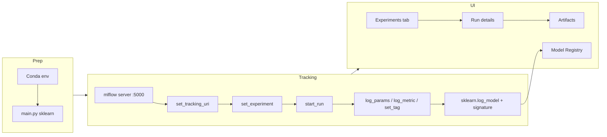
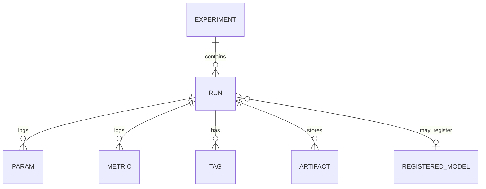
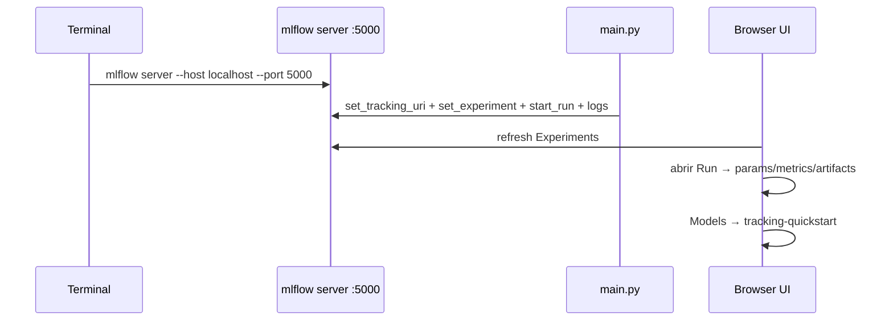

# MLflow Tracking Quickstart — estudio a profundidad

> [!summary] Idea en una frase
> **MLflow Tracking** es un sistema de *experiment tracking*: cada entrenamiento queda registrado como un **Run** dentro de un **Experiment**, con params, metrics, tags, artifacts y (opcional) un modelo en el **Model Registry**, consultable en una UI local vía tracking server.

> [!info] Contexto del material
> Video de terceros que caminan el [quickstart oficial de MLflow](https://mlflow.org/docs/latest/ml/tracking/). No es documentación canónica de Databricks/MLflow; úsalo como demo visual y **corrige** la práctica del narrator donde el `fit()` queda fuera del `start_run()` (ver [[#Antipattern del video]]).

---

## Mapa del video (capítulos)

| Tiempo | Sección |
|---|---|
| 0:00–1:15 | Intro: qué es MLflow + disclaimer + Conda |
| 1:15–3:25 | Script sklearn: Iris + LogisticRegression + métricas |
| 3:25–5:35 | API MLflow: URI, experiment, run, log_* , `log_model` |
| 5:35–7:05 | Arrancar tracking server (`mlflow server`) |
| 7:05–8:50 | Tour UI vacía (Experiments / Models) |
| 8:50–10:10 | Ejecutar `main.py` (troubleshoot import) |
| 10:10–14:13 | UI poblada: run details, charts, artifacts, registry |



---

## 1. Problema que resuelve Tracking

En ML iteras muchas veces: distintos hyperparameters, seeds, features, versiones de datos. Sin tracking terminas con:

- carpetas `model_v3_final_FINAL.pkl`
- métricas en un notebook o en un chat
- imposibilidad de reproducir *qué* produjo el mejor score

**Tracking** formaliza: cada intento es un **Run** auditable (quién, cuándo, con qué params, qué métricas, qué artifacts).

> [!abstract] Relación con TC5061 / deuda técnica
> Encaja con [[Sculley Hidden Technical Debt]]: el *glue* de experimentación (configs, métricas, artefactos) es deuda si no se versiona. Tracking es el primer antídoto operativo antes de CI/CD de modelos.

Q:: ¿Qué problema principal resuelve MLflow Tracking?
A:: Organizar y auditar entrenamientos (params, metrics, artifacts, modelos) para poder comparar y reproducir runs.

---

## 2. Conceptos núcleo: Experiment vs Run

| Concepto | Qué es | Cómo se crea en el video |
|---|---|---|
| **Experiment** | Contenedor lógico de runs relacionados (p. ej. un proyecto o un quickstart) | `mlflow.set_experiment("MLflow Quickstart")` |
| **Run** | Una ejecución concreta bajo ese experiment | `with mlflow.start_run():` |



En la UI:

- pestaña **Experiments** → lista de experiments a la izquierda
- al seleccionar uno → tabla de **Runs** (nombre, created, dataset, duration, source, models)

Q:: ¿Qué diferencia hay entre Experiment y Run?
A:: Experiment es el contenedor; Run es una ejecución individual con sus params/metrics/artifacts bajo ese experiment.

---

## 3. Tracking URI y tracking server

El video **no** usa solo el file store implícito `./mlruns`. Fuerza un **tracking server** HTTP local:

```python
mlflow.set_tracking_uri(uri="http://127.0.0.1:5000")
```

Arranque en terminal (≈5:35–7:05):

```bash
mlflow server --host localhost --port 5000
```

Luego abres `http://127.0.0.1:5000` en el browser.

| Modo | URI típica | Cuándo |
|---|---|---|
| File store local (default) | (omitido) o `file:./mlruns` | Demo rápida sin UI server |
| Tracking server local | `http://127.0.0.1:5000` | Como en el video; UI + API |
| Server remoto / Databricks | URL del backend | Equipo / producción |

> [!tip] Orden práctico
> 1) levanta `mlflow server` · 2) `set_tracking_uri` · 3) corre el training script · 4) refresca la UI.

Q:: ¿Qué comando inicia el tracking server local en el puerto 5000?
A:: `mlflow server --host localhost --port 5000`

---

## 4. Workflow de la API (orden exacto del demo)

Orden demostrado (≈2:18–5:30). **No** usan `autolog`:

```python
import mlflow
from mlflow.models import infer_signature
# + pandas, sklearn.datasets, model_selection, linear_model, metrics

mlflow.set_tracking_uri(uri="http://127.0.0.1:5000")
mlflow.set_experiment("MLflow Quickstart")

# ... load Iris, split, define params, fit LogisticRegression, predict, compute metrics ...

with mlflow.start_run():
    mlflow.log_params(params)
    mlflow.log_metric("accuracy", accuracy)
    # + precision, recall, f1
    mlflow.set_tag("Training Info", "Basic LR model for Iris data")
    signature = infer_signature(X_train, lr.predict(X_train))
    mlflow.sklearn.log_model(
        sk_model=lr,
        artifact_path="iris_model",
        signature=signature,
        input_example=X_train,
        registered_model_name="tracking-quickstart",
    )
```

### Vocabulario de logging

| API | Qué registra |
|---|---|
| `log_params` / `log_param` | Hyperparameters / config (strings, números) |
| `log_metric` | Métricas escalares (accuracy, loss, …); la UI puede graficar |
| `set_tag` | Metadata libre (quién, propósito, dataset note) |
| `infer_signature` | Schema input/output del modelo |
| `mlflow.sklearn.log_model` | Serializa el modelo sklearn + metadata de flavor |

> [!note] Flavors
> `mlflow.sklearn` es un **flavor**: adaptador que sabe cómo guardar/cargar ese ecosistema. Hay flavors para otros frameworks.

---

## 5. Código ML del demo (fuera de MLflow)

| Pieza | Valor en el video |
|---|---|
| Dataset | `sklearn.datasets.load_iris()` |
| Split | train/test (`model_selection`) |
| Modelo | `LogisticRegression` |
| Params tipicos | `solver="lbfgs"`, `max_iter=1000`, `multi_class="auto"`, `random_state=8888` |
| Metrics | accuracy, precision, recall, f1 (sklearn.metrics) |

Q:: ¿Qué dataset y modelo usa el quickstart del video?
A:: Iris (`load_iris`) y `LogisticRegression` de sklearn.

---

## 6. Antipattern del video (importante para el curso)

> [!warning] Duration engañosa
> El narrator dice (≈8:35) que **normalmente quieres meter el training dentro del run**. En el script del video, el `lr.fit(...)` ocurre **antes** de `with mlflow.start_run():`.
>
> Consecuencia: la columna **Duration** en la UI mide sobre todo el tiempo de *logging*, no el de entrenamiento.
>
> **Práctica correcta para TC5061 / labs:**
> ```python
> with mlflow.start_run():
>     lr.fit(X_train, y_train)
>     preds = lr.predict(X_test)
>     # log_params / log_metric / log_model ...
> ```

Esto conecta con disciplina experimental: el run debe encapsular el trabajo que quieres atribuir y comparar.

---

## 7. UI de MLflow (lo que muestra el video)

### 7.1 Experiments

- Lista de experiments
- Tabla de runs: Run Name, Created, Dataset, Duration, Source (`main.py`), Models
- Botón **Compare** visible pero **no demostrado**

### 7.2 Models (Model Registry)

- Lugar para “modelos buenos” versionados
- El demo registra automáticamente con `registered_model_name="tracking-quickstart"`
- Menciona servir / descargar vía Python API para predecir
- UI muestra snippets de predicción (pandas / Spark)

### 7.3 Run details (tras click en un run)

| Sección | Contenido visto |
|---|---|
| Description | Texto / metadata del run |
| Datasets | Si se logueó dataset (en el demo puede quedar vacío) |
| Parameters | solver, max_iter, multi_class, random_state, … |
| Metrics | p. ej. accuracy (chart al click; en el demo accuracy = 1.0) |
| Tags | `Training Info` = Basic LR model for Iris data |
| Artifacts | Ver abajo |

### 7.4 Artifacts típicos tras `log_model`

| Archivo | Rol |
|---|---|
| `MLmodel` | Metadata del flavor + rutas |
| `model.pkl` | Modelo serializado |
| `conda.yaml` / `python_env.yaml` / `requirements.txt` | Entorno reproducible |
| `input_example.json` | Ejemplo de input |
| (+ schema / signature) | Tipos input/output (tensors en el demo) |

Q:: Nombra al menos cuatro artifacts que aparecen tras `sklearn.log_model`.
A:: Ejemplos: `MLmodel`, `model.pkl`, `conda.yaml`, `requirements.txt`, `python_env.yaml`, `input_example.json`.

---

## 8. Flujo extremo a extremo (reproduce en tu máquina)



Checklist mínimo:

1. Env con `mlflow`, `scikit-learn`, `pandas`
2. `mlflow server --host localhost --port 5000`
3. Script con URI `http://127.0.0.1:5000`
4. `python main.py`
5. Refresh UI → experiment **MLflow Quickstart** → inspeccionar run

> [!bug] Lo que pasó en el video (≈8:50)
> Primer `python main.py` falló con `No module named mlflow` (env/terminal incorrecto). Tras activar el env correcto, el run apareció al refrescar.

---

## 9. Qué NO cubre (o solo menciona) este video

| Tema | ¿En el video? |
|---|---|
| `mlflow.autolog()` | No |
| Compare runs side-by-side | Botón visible, **no** usado |
| MLflow Projects | No |
| Deploy / serving real | Solo mención vía Registry |
| Tracking remoto / auth | No |
| Dataset logging formal | UI tiene sección; no es el foco |

Para profundizar en docs oficiales: [MLflow Tracking](https://mlflow.org/docs/latest/ml/tracking/), Autologging, Tracking APIs (links del Aprende de TC5061).

---

## 10. Glosario rápido

| Término | Definición operativa |
|---|---|
| **Tracking** | Subsistema que registra runs (params, metrics, artifacts) |
| **Tracking URI** | Dónde apunta el cliente (`file:` o `http://…`) |
| **Tracking server** | Proceso que sirve UI + API de tracking |
| **Param** | Input de config / hyperparameter |
| **Metric** | Medida de calidad o loss (puede ser time-series) |
| **Tag** | Label libre de metadata |
| **Artifact** | Archivo asociado al run (modelo, plots, env) |
| **Signature** | Schema de I/O del modelo |
| **Flavor** | Integración por framework (`sklearn`, `pytorch`, …) |
| **Model Registry** | Catálogo versionado de modelos “promovibles” |

---

## 11. Conexión con tu lab TC5061

- El A01 (`hello_mlflow`) ya te obligó a un primer experiment; este video es la **vista UI + Registry** del mismo ciclo.
- Prep sync 24 sep: Tracking docs + este video (14:12) + Dorard ML Canvas son piezas distintas: Canvas = diseño del problema; Tracking = evidencia del experimento.
- Cuando compares runs en un proyecto real (p. ej. eval gate), usa **Compare** de la UI o la API de search runs — no lo demuestran aquí, pero es el siguiente paso natural.

---

## Flashcards extra

Q:: ¿Cuál es el orden típico de llamadas MLflow en el quickstart del video?
A:: `set_tracking_uri` → `set_experiment` → `start_run` → `log_params` / `log_metric` / `set_tag` → `infer_signature` → `sklearn.log_model` (con `registered_model_name`).

Q:: ¿Qué hace `registered_model_name` en `log_model`?
A:: Registra el modelo en el Model Registry bajo ese nombre (p. ej. `tracking-quickstart`) además de guardarlo como artifact del run.

Q:: ¿Por qué accuracy=1.0 en Iris + LogisticRegression no debe sorprenderte?
A:: Iris es un dataset toy linealmente separable en gran medida; un score perfecto no implica generalización en problemas reales.

Q:: ¿Autolog aparece en este video?
A:: No. Todo el logging es manual con `log_*` y `sklearn.log_model`.

---

## Referencias

- Video: [YouTube cjeCAoW83_U](https://www.youtube.com/watch?v=cjeCAoW83_U)
- Docs: [MLflow Tracking](https://mlflow.org/docs/latest/ml/tracking/)
- Canvas TC5061: `Aprende | Intro MLOps + MLFlow Tracking básico`
- Relacionado curso: [[Sculley Hidden Technical Debt]], [[hello_mlflow]], [[Introducing MLOps]]

---

## Metadatos de estudio

- Analizado: transcript EN + revisión visual frame-by-frame del MP4 local
- Duración medida: ≈14:12 (852 s)
- Nota pedagógica propia: antipattern `fit()` fuera del run (no explícito como error en el video; inferido del código + comentario del narrator sobre Duration)
